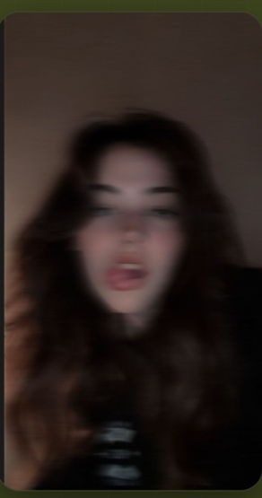
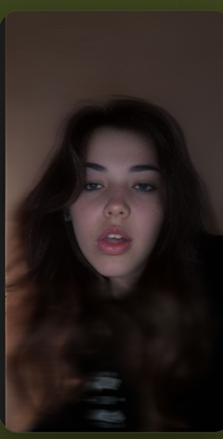

# Photo Enhancer

A browser-based image enhancement engine that reconstructs low-resolution photographs into high-fidelity, professionally polished output — entirely client-side, with no data uploaded to any server.

---

## Before / After

<table>
  <tr>
    <th align="center">Before</th>
    <th align="center">After</th>
  </tr>
  <tr>
    <td align="center"></td>
    <td align="center"></td>
  </tr>
</table>

---

## What It Does

A multi-stage computational pipeline is applied to any photograph dropped into the interface. The result is a sharper, more detailed, cinematically graded version of the original — processed in seconds using your device's own hardware.

**Core capabilities**

- Dual-scale luminance sharpening — fine texture and edge clarity in a single pass
- Adaptive shadow recovery with log-tone mapping — lifts crushed blacks without clipping highlights
- CLAHE local contrast enhancement — brings out midtone detail across the full dynamic range
- Green Orange cinematic colour grade — teal shadows, warm highlights, 72% blend intensity
- Lightroom-style vibrance — boosts desaturated areas selectively, protects skin tones
- Detail-preserve mode — zero smoothing, every pixel sharpened at grain level

---

## Processing Pipeline

```
Input Image
    │
    ├── Detail density map (high-frequency analysis)
    │
    ├── Step 1 — Pixel passthrough (no denoise, full texture preserved)
    │
    ├── Step 2 — Dual-scale Unsharp Mask
    │           Fine scale  r=1  (fabric, pores, hair)
    │           Coarse scale r=2  (edges, silhouettes)
    │
    ├── Step 3 — CLAHE  (clip 1.4 – 2.2, adaptive local contrast)
    │
    ├── Step 4 — YUV colour processing
    │           Shadow lift · Highlight rolloff · S-curve contrast
    │           Vibrance · Saturation · Colour temperature
    │
    ├── Step 5 — Lanczos-3 upscaling  (up to 4× output resolution)
    │
    └── Step 6 — Green Orange cinematic grade (72% intensity)
                 Brightness · Contrast · Clarity · Hue · Split tone
```

---

## Modes

| Mode | Engine | Description |
|------|--------|-------------|
| Canvas Math | Client-side | Instant processing, no network required |
| Replicate Cloud AI | CodeFormer | Neural face restoration via Replicate API |
| Modal Serverless GPU | Real-ESRGAN | Full-resolution upscaling via Modal GPU |

---

## Technology

Built with vanilla HTML, CSS, and JavaScript — no frameworks, no dependencies, no build overhead beyond Vite for bundling. The enhancement pipeline runs entirely on the Canvas API using typed arrays and custom filter implementations.

---

## Local Development

```bash
npm install
npm run dev
```

Production build:

```bash
npm run build
```

---

## Deployment

The project is configured for zero-configuration deployment on Vercel. Push to `main` and it goes live automatically.

---

*Clarity from noise.*
